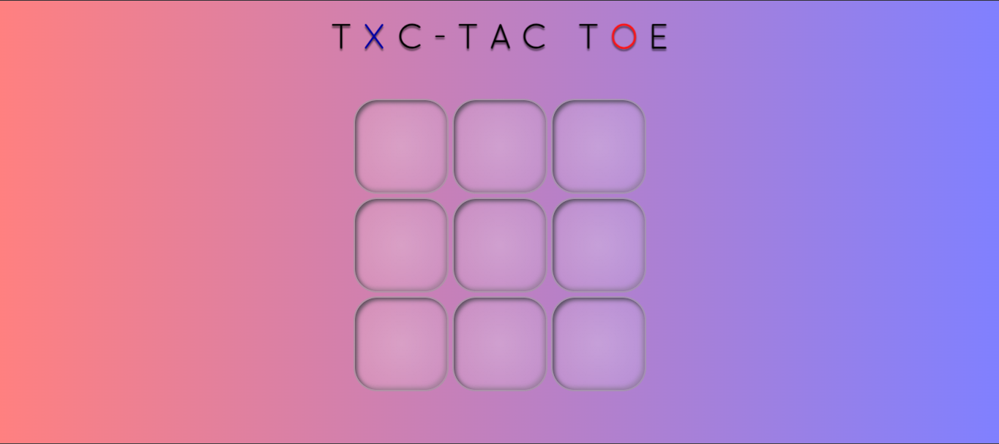

# ⭕ Tic-Tac-Toe ❌

> A fun and interactive Tic Tac Toe game built with HTML, CSS, and JavaScript. Play classic X vs O directly in your browser!

---

## 🕹️ About

> This is a simple and elegant Tic Tac Toe game where two players can alternate turns by placing X and O in a 3×3 grid. The game detects winning combinations, draws, and allows players to restart and play again.

---

## 📸 Preview


Live Demo: https://samuel-fsilva.github.io/tic-tac-toe/

---

## How It Works
> The game board is a 3×3 grid. Two players take turns clicking an empty square to place their mark:

 - X goes first
 - After each move, the game checks for:
   - a winning row (horizontal, vertical, or diagonal)
   - a draw if all cells are filled
 - When the game ends, a message is displayed
 - Click the Reset button to start a new game

---

## 🚀 Features

 - 🎮 Click to place X or O
 - 🔁 Automatic turn switching
 - 🏆 Detects wins and draws
 - 🔄 Reset / Restart functionality
 - 👌 Lightweight and responsive interface
 - 🎨 Smooth gradient UI with visual feedback

---

## 🛠️ Technologies

- HTML
- CSS
- JavaScript (Vanilla)

> No frameworks — just pure frontend code!
---

## 🧩 Installation

```
# Clone the repository
git clone https://github.com/samuel-fsilva/tic-tac-toe.git

# Enter the folder
cd tic-tac-toe
```

---

## 📂 Project Structure

```
tic-tac-toe/
│── fonts/
│── img/
│── scripts/
│   └── script.js
│── styles/
│   └── animetion.css
│   └── index.css
│── js/
│   └── app.js
│── index.html
│── README.md
```

---

## 🗺️ Roadmap

- [ ] Add the "vs CPU" game mode

---

## 🙋‍♂️ Author

GitHub: https://github.com/samuel-fsilva
